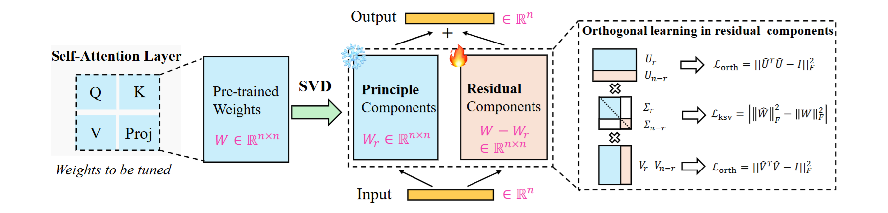
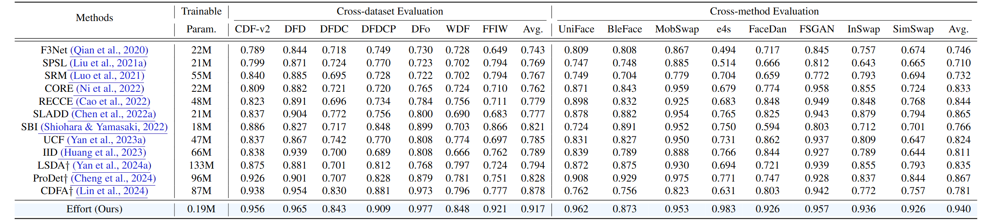
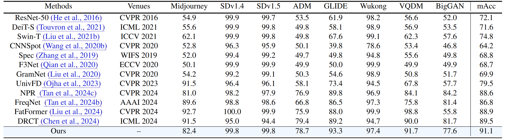

# Effort: Orthogonal Subspace Decomposition for Generalizable AI-Generated Image Detection ([Paper](https://arxiv.org/abs/2411.15633); [Checkpoints](https://drive.google.com/drive/folders/19kQwGDjF18uk78EnnypxxOLaG4Aa4v1h?usp=sharing))

[](https://creativecommons.org/licenses/by-nc/4.0/)   

> 🎉🎉🎉 **Our paper has been accepted by ICML 2025 Oral 🏆!**

Welcome to our work **Effort**, for detecting AI-generated images (AIGIs).

In this work, we propose: (1) a **very very easy and effective method** for generalization AIGI detection😀; and (2) a **novel analysis tool** for quantifying the "degree of model's overfitting"😊.


The figure below provides a brief introduction to our method: our method can be **plug-and-play inserted** into *any* vit-based large models such as CLIP.

<div align="center"> 
</div>
<div style="text-align:center;">
  
</div>


If you want to know a **very high-level code implementation of our method**, see below.

```
# 🟩 Perform SVD on the original weight
U, S, Vh = torch.linalg.svd(module.weight.data, full_matrices=False)

# 🟨 Keep top r singular components (main weight)
U_r = U[:, :r]      # 🔵 Shape: (out_features, r)
S_r = S[:r]         # 🔵 Shape: (r,)
Vh_r = Vh[:r, :]    # 🔵 Shape: (r, in_features)

# 🟪 Reconstruct the main weight (fixed)
weight_main = U_r @ torch.diag(S_r) @ Vh_r

# 🟥 Residual components (trainable)
U_residual = U[:, r:]    # 🔵 Shape: (out_features, n - r)
S_residual = S[r:]       # 🔵 Shape: (n - r,)
Vh_residual = Vh[r:, :]  # 🔵 Shape: (n - r, in_features)
```

If you want to see **more method-specific implementation details**, please see the file [effort_implementation.py](https://github.com/YZY-stack/Effort-AIGI-Detection/blob/main/DeepfakeBench/training/detectors/effort_detector.py).

---


The following two tables display the **part results** of our method on **both the (face) deepfake detection benchmark and the (natural) AIGI detection benchmark**. Please refer to our paper for more results.

<div align="center"> 
</div>
<div style="text-align:center;">
  
</div>


<div align="center"> 
</div>
<div style="text-align:center;">
  
</div>

---


## ⏳ Quick Start (if you just want to do the *inference*)
<a href="#top">[Back to top]</a>


### 1. Installation
Please run the following script to install the required libraries:

```
sh install.sh
```

### 2. Download checkpoints
If you are a deepfake player, more interested in face deepfake detection:
- The checkpoint of "CLIP-L14 + our Effort" **training on FaceForensics++** are released at [Google Drive](https://drive.google.com/file/d/1m4fyJecABU-Yk3bJ4b1WhUwQa0xCkMLI/view?usp=drive_link).

If you are interested in detecting general AI-generated images, we provide two checkpoints that are trained on GenImage and Chameleon datasets, respectively:
- The checkpoint of "CLIP-L14 + our Effort" **training on GenImage (sdv1.4)** are released at [Google Drive](https://drive.google.com/file/d/1UXf1hC9FC1yV93uKwXSkdtepsgpIAU9d/view?usp=sharing).
- The checkpoint of "CLIP-L14 + our Effort" **training on Chameleon (sdv1.4)** are released at [Google Drive](https://drive.google.com/file/d/1GlJ1y4xmTdqV0FfIcyBwNNU6cQird9DR/view?usp=sharing).


### 3. Run demo
You can then infer **one image *or* one folder with several images** using the pretrained weights. 

Specifically, run the following line:

```
cd DeepfakeBench/

python3 training/demo.py --detector_config training/config/detector/effort.yaml --weights ./training/weights/{NAME_OF_THE_CKPT}.pth --image {IMAGE_PATH or IMAGE_FOLDER}
```

After running the above line, you can obtain the prediction results (fake probabilities) for each image. 


Note, you are processing a **face image**, please add the ``--landmark_model ./preprocessing/shape_predictor_81_face_landmarks.dat`` to **extract the facial region** for inference, as our model (trained on face deepfakes) used this face extractor for processing faces.


---


## 💻 Reproduction and Benchmarking Evaluation

<a href="#top">[Back to top]</a>

Since I am the creator and developer of [DeepfakeBench](https://github.com/SCLBD/DeepfakeBench), the **data, codebase, and benchmarking protocols are mainly used from it**. If you are a researcher in (face) deepfake detection, I highly recommend you try DeepfakeBench.

If you want to **try other codebases, such as UnivFD**, we provide a folder `UniversalFakeDetect_Benchmark/` to reproduce and implement our method using its codebase. Using this codebase, you can then **reproduce the results of Table 2 of our manuscript**.

Below, we provide the **detailed procedure to use DeepfakeBench to reproduce the results** of our paper, such as Table 1.


### 1. Download datasets

If you want to reproduce the results of each deepfake dataset, you can download the processed datasets (have already finished preprocessing such as frame extraction and face cropping) from [DeepfakeBench](https://github.com/SCLBD/DeepfakeBench). For evaluating more diverse fake methods (such as SimSwap, BlendFace, DeepFaceLab, etc), you are recommended to use the just-released [DF40 dataset](https://github.com/YZY-stack/DF40) (with 40 distinct forgery methods implemented).


### 2. Preprocessing (**optional**)

If you only want to use the processed data we provided, you can skip this step. 

Otherwise, you need to use the following codes for doing **data preprocessing strictly following DeepfakeBench**.


### 3. Rearrangement (**optional**)

> "Rearrangment" here means that we need to **create a *JSON file* for each dataset for collecting all frames within different folders**. Please refer to **DeepfakeBench** and **DF40** for the provided JSON files for each dataset.

After running the above line, you will obtain the JSON files for each dataset in the `./preprocessing/dataset_json` folder. The rearranged structure organizes the data in a hierarchical manner, grouping videos based on their labels and data splits (*i.e.,* train, test, validation). Each video is represented as a dictionary entry containing relevant metadata, including file paths, labels, compression levels (if applicable), *etc*. 


### 4. Training

First, you can run the following lines to train the model:
- For multiple GPUs:
```
python3 -m torch.distributed.launch --nproc_per_node=4 training/train.py \
--detector_path ./training/config/detector/effort.yaml \
--train_dataset FaceForensics++ \
--test_dataset Celeb-DF-v2 \
--ddp
```
- For a single GPU:
```
python3 training/train.py \
--detector_path ./training/config/detector/effort.yaml \
--train_dataset FaceForensics++ \
--test_dataset Celeb-DF-v2 \
```

### 5. Testing

Once you finish training, you can test the model on several deepfake datasets such as DF40.

```
python3 training/test.py \
--detector_path ./training/config/detector/effort.yaml \
--test_dataset simswap_ff blendface_ff uniface_ff fomm_ff deepfacelab \
--weights_path ./training/weights/{CKPT}.pth
```
Then, you can obtain similar evaluation results reported in our manuscript.


---

## 📕 Citation
If you find our work helpful to your research, please consider citing our paper as follows:
```
@article{yan2024effort,
  title={Effort: Efficient Orthogonal Modeling for Generalizable AI-Generated Image Detection},
  author={Yan, Zhiyuan and Wang, Jiangming and Wang, Zhendong and Jin, Peng and Zhang, Ke-Yue and Chen, Shen and Yao, Taiping and Ding, Shouhong and Wu, Baoyuan and Yuan, Li},
  journal={arXiv preprint arXiv:2411.15633},
  year={2024}
}
```


